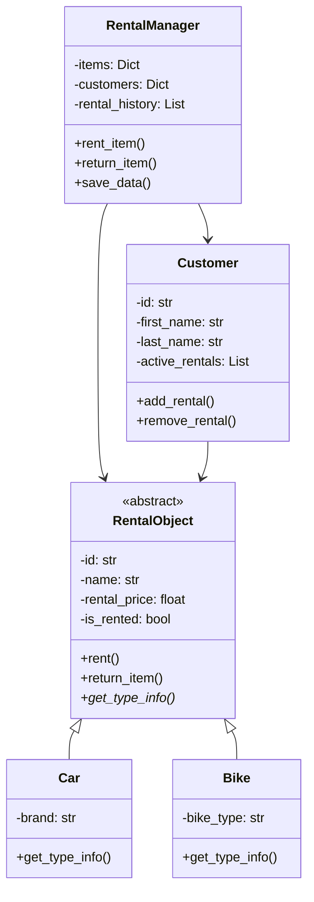

# Rental Management System - Final Report

## 1. System Architecture Description

The Rental Management System is a web application designed to facilitate the management of rental items (bikes and cars) and customers. Built using Flask, the system follows a modular architecture that adheres to object-oriented principles, ensuring maintainability and scalability.

### Core Modules
1. **Models Module** (`models.py`)
   - This module defines the core data structures for rental items. It includes an abstract base class, `RentalObject`, which provides a common interface for all rental items. Specialized classes, `Car` and `Bike`, inherit from this base class, allowing for type-specific behavior and attributes.

2. **Customer Module** (`customer.py`)
   - This module manages customer data and behavior. It encapsulates customer-related functionalities, such as adding rentals and checking for active rentals. The class ensures that customer information is handled securely and efficiently.

3. **Rental Manager Module** (`rental_manager.py`)
   - The RentalManager class serves as the central business logic component. It orchestrates the interactions between rental items and customers, manages data persistence, and enforces business rules. This module is responsible for adding, removing, and editing items and customers, as well as handling rental operations.

4. **Web Interface Module** (`routes.py`, `app.py`)
   - This module defines the web interface using Flask. It handles HTTP routes, processes user requests, and renders the appropriate templates. The web interface provides a user-friendly experience for managing rentals and viewing histories.

### Key Classes
1. **RentalObject** (Abstract Base Class)
   - Serves as the foundation for all rental items, defining common attributes and methods for managing rental operations.

2. **Car** and **Bike** (Concrete Classes)
   - These classes extend the RentalObject class, implementing specific attributes and behaviors relevant to each type of rental item.

3. **Customer**
   - Represents a customer in the system, managing their information and tracking their active rentals.

4. **RentalManager**
   - Centralizes the management of rental operations, ensuring that all interactions between customers and items are handled correctly.

## 2. Diagrams or Schematics

### Class Diagram


## 3. Screenshots of the Application

### Main Dashboard


### Item Management


### Customer Management


### Item History


### Customer History


### Add Item Form


### Add Customer Form


### Recent Rental History


## 4. Key Code Fragments

### 1. Abstract Base Class for Rental Items
```python
class RentalObject(ABC):
    def __init__(self, id, name, rental_price):
        self._validate_init_params(id, name, rental_price)  # Validate parameters
        self._id = id
        self._name = name
        self._rental_price = rental_price
        self._is_rented = False
        self._rental_history = []
        self._current_rental_start = None

    @abstractmethod
    def get_type_info(self):
        """Get type-specific information about the rental object"""
        pass
```
This code demonstrates:
- Abstract base class implementation
- Proper encapsulation
- Input validation
- Clear method documentation

### 2. Rental Operation Logic
```python
def rent_item(self, customer_id, item_id):
    """Rent an item to a customer"""
    customer = self._customers.get(customer_id)
    if not customer:
        raise ValueError("Invalid customer ID")  # Validate customer ID
    
    item = self._items.get(item_id)
    if not item:
        raise ValueError("Invalid item ID")  # Validate item ID

    # These will raise ValueError if there are issues
    item.rent()  # Rent the item
    customer.add_rental(item)  # Add item to customer's rentals
    
    self._active_rentals[(customer_id, item_id)] = {
        'start_time': datetime.now(),
        'item': item,
        'customer': customer
    }
    self.save_data()  # Save after successful rental
    return True
```
This code shows:
- Error handling
- Data validation
- Transaction management
- Automatic data persistence

### 3. Customer Management
```python
class Customer:
    def __init__(self, id, first_name, last_name, address, contact_number):
        self._id = id
        self._first_name = first_name
        self._last_name = last_name
        self._address = address
        self._contact_number = contact_number
        self._active_rentals = []

    @property
    def active_rentals(self):
        """Get customer's active rentals"""
        return self._active_rentals.copy()  # Return copy to prevent direct modification
```
This code demonstrates:
- Property usage for encapsulation
- Data protection
- Validation logic
- Clear method responsibilities

## 5. Instructions for Running

1. **Prerequisites**
   - Python 3.8 or higher
   - pip package manager
   - Virtual environment (recommended)

2. **Installation Steps**
   ```bash
   # Clone the repository
   git clone https://github.com/yourusername/rental_system.git
   cd rental_system

   # Create and activate virtual environment (optional but recommended)
   python -m venv venv
   source venv/bin/activate  # On Windows: venv\Scripts\activate

   # Install dependencies
   pip install -r requirements.txt
   ```

3. **Running the Application**
   ```bash
   # Start the Flask application
   python app/app.py

   # Access the application in a web browser
   # URL: http://localhost:5000
   ```

## 6. Conclusion

### Implemented Features
1. Complete rental item management system
2. Customer tracking and management
3. Rental operations with cost calculation
4. History tracking and reporting
5. Web-based user interface
6. Data persistence using JSON

### Main Challenges
1. **Object-Oriented Design**
   - Designing proper class hierarchies
   - Implementing effective encapsulation
   - Managing object relationships

2. **Data Management**
   - Ensuring data consistency
   - Implementing proper validation
   - Handling concurrent operations

3. **User Interface**
   - Creating intuitive navigation
   - Implementing responsive design
   - Handling form submissions

### Potential Improvements
1. **Technical Enhancements**
   - Database integration (e.g., SQLAlchemy)
   - User authentication and authorization
   - API endpoints for external integration
   - Automated testing suite

2. **Feature Additions**
   - Reservation system
   - Payment processing
   - Email notifications
   - Report generation
   - Analytics dashboard

3. **User Experience**
   - Enhanced search capabilities
   - Mobile-friendly interface
   - Real-time updates
   - Bulk operations

The Rental Management System successfully demonstrates object-oriented principles while providing a practical solution for rental business operations. The modular design allows for easy maintenance and future enhancements.
